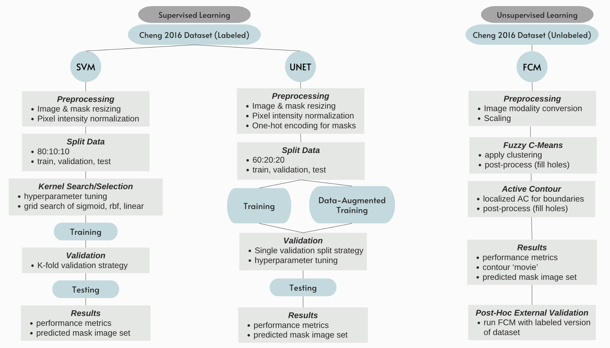

# Brain-Tumor-Segmentation
A Comparative Study of Machine Learning and Deep Learning Multi-Class Segmentation Methods

Graduate Course: Emory CS534 'Intro. to Machine Learning', taught by Dr Hyeok Kwon, Spring 2024, PhD Year 1

See Final Report and Project Proposal for context. 

----------------  Use as .ipynb or .py ----------------

If you prefer .py files over the .ipynb, simply download the .ipynb files locally, 'open with' VScode, select 'Restriced' < 'Trust this file', select '...', 'Export', 'Python script'. 

----------------  Virtual Environment ----------------

To create the necessary virtual environment for this project see requirements.txt.

---------------- About the Data ----------------
Training/Testing: Cheng 2016 dataset, refer to Jun Cheng. Brain tumor dataset. figshare. Dataset, 1512427(5), 2017. (note: open access)
Benchmarking: Used a combination of 2 datasets:

 - BRaTs 2018 dataset containing glioma tumor data, request access at https://www.med.upenn.edu/sbia/brats2018/data.html (note: do NOT ask me for access)

- Brain Tumor Classification Dataset 2018 containing meningioma and pituitary tumor data, refer to: https://github.com/SartajBhuvaji/Brain-Tumor-Classification-DataSet/tree/master/Training

datasets folder temporarily empty due to exceeded LFS storage this month, to be converted to enterprise and reuploaded

----------------  About the Files ----------------

To balance Cheng 2016 dataset -> class_balancing_alg.ipynb

To remove Cheng 2016 dataset labels for FCM clustering algorithm -> label_removal_alg.ipynb

To convert BRaTS .nii.gz files to .mat -> BRaTs_conversion_alg.ipynb

To convert full benchmark dataset for preprocessing -> benchmark_data_converter_alg.ipynb

----------------  About the Models ----------------

Documentation and recommended settings are already included throughout the Jupyter files. 

Run UNET model -> UNET_latest_version.ipynb

Run FCM model -> FCM+AR_main.m in conjunction with ac.m, tools_FCM.m, tools_KM.m

Run SVM model -> SVM_latest_vers.ipynb

----------------  About Pretrained Models ----------------

The .h5 trained model files greatly exceed github's storage limit, therefore they cannot be uploaded and you must obtain them by running the code and training the models yourself. (PENDING UPDATE looking to overcome this limitation soon)
